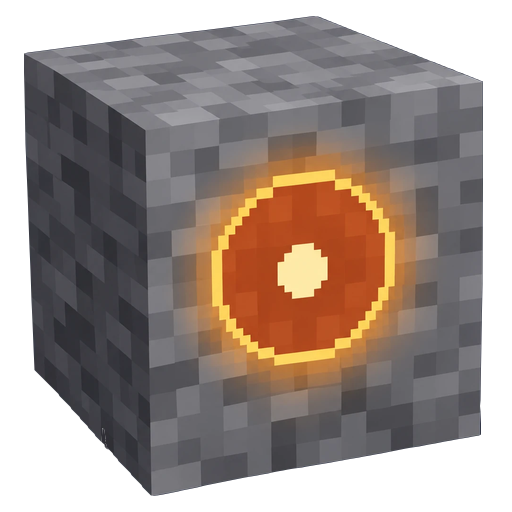
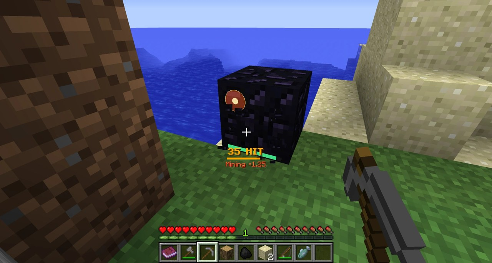

# Weak Spot Mining（弱点破壊 Mod）

日本語 | [English](README.en.md)

Fortnite の資材集めにある「弱点（クリティカル）を叩くと速く壊せる」仕組みを、Minecraft に導入する Mod です。採掘・栽培・移動・弓など、様々な場面に光る円（弱点）が出現し、当てると各動作が加速します。

## ⬇ ダウンロード

- **[CurseForge](https://www.curseforge.com/minecraft/mc-mods/weakspot)**

対応: **Minecraft Java Edition 1.12.2 + Forge**（開発・動作確認は Forge 14.23.5.2860。古い Forge では一部の機能が動かない可能性あり）。マルチプレイでは、サーバーと全員に同じマイナーバージョンが必要です（詳細は [doc/install.md](doc/install.md)）。

## 操作

| キー | 機能 |
|---|---|
| **K** | 弱点破壊メニュー（統計・ヒット音・弱点マーカー（種類別のオン／オフ・色・形）・設定・ガイド） |
| **HOME** | 全弱点のオン／オフ切り替え（建築中など、邪魔な時に） |

キーは「設定 → 操作設定 → 弱点破壊」で変更できます。

## 弱点の種類

| 種類 | 操作 | 効果 |
|---|---|---|
| [採掘](doc/play.md#採掘左クリック長押し) | 左クリック長押しで採掘 | 採掘速度が上昇（コンボが続くほど更に上昇）。破壊時に道具の耐久値が少し回復 |
| [作物・苗木](doc/play.md#作物苗木の成長素手で右クリック長押し) | 成長途中の作物・苗木に素手で右クリック長押し | 成長が進む |
| [収穫](doc/play.md#収穫実った作物に素手で右クリック長押し) | 実った作物に素手で右クリック長押し | 収穫と植え直しを自動で行う |
| [機械](doc/play.md#機械の加速しゃがんで素手で右クリック長押し) | かまど等の機械に、しゃがんで素手で右クリック長押し | 機械の処理が加速 |
| [動物](doc/play.md#動物素手で右クリック長押し) | 動物に素手で右クリック長押し（馬・村人等はしゃがんで） | 子供の成長・繁殖・羊毛・産卵・村人の取引回復が早まる |
| [釣り](doc/play.md#釣り釣り竿を持って左クリック) | 釣り竿を持ち、浮きの周囲の弱点を左クリック | 魚が早く掛かる |
| [弓](doc/play.md#弓引き絞り中に照準を合わせる) | 弓を引いている間、照準を弱点に合わせる | 引き絞りが速くなる。引き切った後は矢の威力が上昇 |
| [近接](doc/play.md#近接剣斧を持ち敵の近くで照準を合わせる) | 剣か斧を持ち、敵の近くで照準を合わせる | 力が溜まり、次の攻撃が強力なクリティカルに |
| [投擲物](doc/play.md#投擲物所持中に照準を合わせる) | エンダーパール・雪玉等を持ち、照準を合わせる | 次に投げた物が速く遠くまで飛ぶ |
| [飲食](doc/play.md#飲食飲食中に照準を合わせる) | 飲食中に照準を合わせる | 飲食時間が短縮 |
| [乗り物](doc/play.md#乗り物移動中に照準を合わせる) | 馬・豚・トロッコ・ボートで移動中に照準を合わせる | 移動速度が上昇 |
| [はしご](doc/play.md#はしご昇降中に照準を合わせる) | はしご・ツタの昇降中に照準を合わせる | 昇降速度が上昇 |
| [ダッシュ](doc/play.md#ダッシュダッシュ中に照準を合わせる) | ダッシュ中に照準を合わせる | 走行速度が上昇 |
| [エリトラ](doc/play.md#エリトラ飛行中に照準を合わせる) | エリトラで飛行中に照準を合わせる | 視線の方向へ急加速 |
| [ネザーゲート](doc/play.md#ネザーゲートゲート内で照準を合わせる) | ゲート内で照準を合わせる | 転移までの待ち時間が短縮 |
| [泳ぎ](doc/play.md#泳ぎ水中を泳ぎながら照準を合わせる) | 水中を泳ぎながら照準を合わせる | 少し突進し、泳ぐ速さが上昇 |
| [睡眠](doc/play.md#睡眠就寝中にマーカーをクリック) | 夜にベッドで就寝中、画面のマーカーをクリック | 時間が進み、朝が早く来る |
| [エンチャント](doc/play.md#エンチャントエンチャント台の画面でマーカーをクリック) | エンチャント台の画面のマーカーをクリック | 3 つの候補を再抽選（消費なし） |

連続して当てると**コンボ**が繋がり、ヒット音の音階が上昇します。種類別の詳細は [doc/play.md](doc/play.md)。

## 最近の更新

### 1.10.0

- **泳ぎの弱点**を追加: 水中を泳ぎながら照準を合わせると、少し突進し、しばらく速く泳げる
- 設定をサーバー／クライアントと種類ごとのカテゴリに整理（今の設定ファイルは自動で移行）。ほかの人の節目をチャットで全員に知らせる。統計の平均ヒット数を、壊したブロックだけで計算
- **1.9.x とは接続不可**（サーバーと全員を 1.10.0 に）

### 1.9.6

- サーバーから届く案内（版の違いの知らせ・村人の繁殖の案内）を、プレイヤーの言語で表示（サーバーの更新が必要）
- チャットの頭を `[WeakSpot]` に統一。キー割り当ての分類に英語名（Weak Spot Mining）を併記
- 通信内容・保存データ・設定に変更なし。1.9.x 同士はそのまま接続可能

### 1.9.5

- ヒット音がコンボで和音に（25 で 2 音、100 で 3 音）。コンボの区切りと累計の節目の音はベルで聞き取りやすく、駆け上がりの間は通常のヒット音を控えめに
- コンボ 10 以上が途切れた時に下がる 2 音
- 通信内容・保存データに変更なし（設定を 1 つ追加）。1.9.x 同士はそのまま接続可能

全ての更新履歴は [CHANGELOG.md](CHANGELOG.md) を参照。

## もっと詳しく

| 文書 | 内容 |
|---|---|
| [doc/play.md](doc/play.md) | 詳しい遊び方（種類別・ヒット音・コンボ・統計・弱点マーカー・節目・マルチプレイ） |
| [doc/install.md](doc/install.md) | 導入（導入先・更新時の注意） |
| [doc/config.md](doc/config.md) | 設定の一覧・管理コマンド |
| [doc/development.md](doc/development.md) | 開発（ビルド・バージョン方針） |
| [doc/spec/README.md](doc/spec/README.md) | 仕様書の一覧 |
| [CHANGELOG.md](CHANGELOG.md) | 更新履歴 |

**不具合報告**: ゲーム内のチャットで `/weakspot bug` と入力すると、報告方法と環境情報が表示されます（[issue](https://github.com/zeusisgood/weakspot/issues) に送信できます）。

## ライセンス

[MIT License](LICENSE)。

- **Modpack への同梱は自由**です。許可や連絡は不要ですが、[issue](https://github.com/zeusisgood/weakspot/issues/new/choose)（「Modpack の報告」）で教えてもらえると励みになります。
- 紹介や配布の際は、jar を再アップロードせず、[CurseForge のページ](https://www.curseforge.com/minecraft/mc-mods/weakspot)へのリンクで案内してください。
