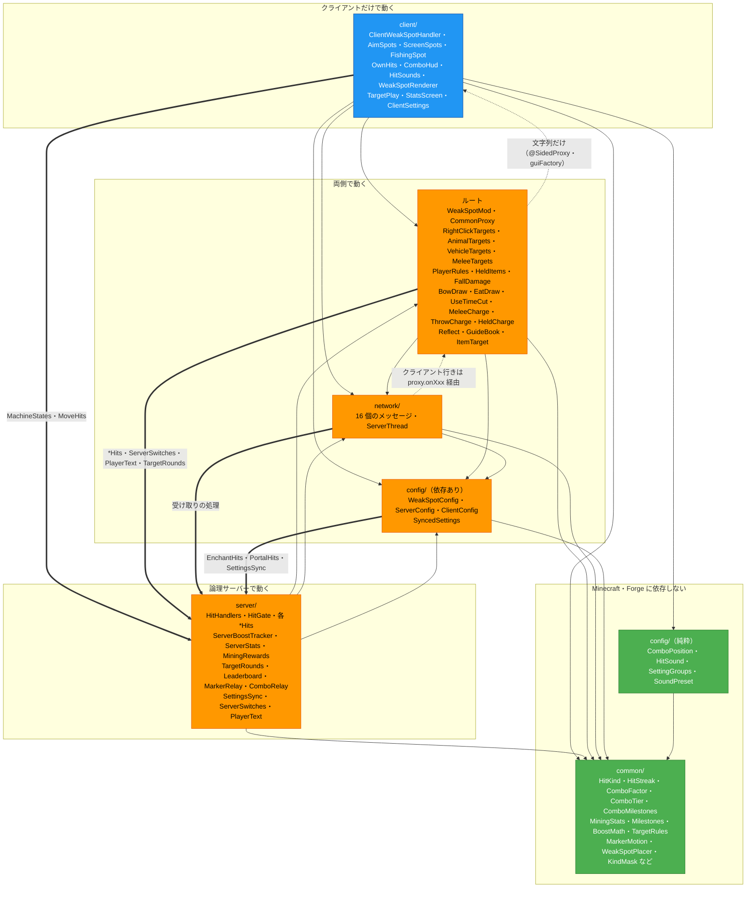

# 図 1　全体構成

[← 図の一覧に戻る](README.md)

パッケージ（`io.github.zeusisgood.weakspot` の下）どうしの依存です。矢印は「使う側 → 使われる側」で、各ファイルの `import` から調べました。

## 凡例

| 見た目 | 意味 |
|---|---|
| 緑 `#4CAF50` | Minecraft・Forge のクラスを使わない（`java.util` と `common/` だけ） |
| 橙 `#FF9800` | Minecraft・Forge のクラスを使う（両側、またはサーバー） |
| 青 `#2196F3` | Minecraft・Forge を使い、クライアントにだけ読み込まれる（`@EventBusSubscriber(value = Side.CLIENT)`） |
| 実線の矢印 | 下の層へ向かう、ふつうの依存 |
| 太い矢印 | `server/` へ入る依存（`server/` 以外のパッケージが、サーバーの処理を直接呼ぶ） |
| 点線の矢印 | クラスを直接は参照しない依存（文字列・プロキシ経由） |

## 注記

- `common/` は `common/` の中と `java.util` だけを使う（MC・Forge・ほかのパッケージへの依存なし）。
- `config/` は 2 つに分かれる: 設定の本体（`@Config` の `WeakSpotConfig` など、Forge に依存）と、値や表だけのクラス（`SoundPreset` は `common/HitScale` だけを使う）。
- `server/` は `client/` を使わない。`client/` から `server/` へは 3 か所（`ClientWeakSpotHandler`・`OwnSpotBars` → `MachineStates.hasBar`、`SprintSpot` → `MoveHits`）。
- 太い矢印の内訳:
  - ルート → `server/`: `RightClickTargets` → `RightClickHits`・`ServerSwitches`・`PlayerText`、`AnimalTargets` → `AnimalHits`・`ServerSwitches`、`MeleeCharge` → `MeleeHits`、`ItemTarget` → `TargetRounds`、`WeakSpotMod` → `MachineAccelerator`・`MachineStates`・`VehicleHits`・`WeakSpotCommand`
  - `network/` → `server/`: `HitMessage` → `HitHandlers`、`MarkerMessage` → `MarkerRelay`・`ServerSwitches`、`QueryMessage` → `QueryHandlers`、`StatsRequestMessage` → `ServerStats`、`SwitchMessage` → `ServerSwitches`、`TargetActionMessage` → `TargetRounds`
  - `config/` → `server/`: `SyncedSettings` → `EnchantHits`・`PortalHits`（読めないときに false で送るため）、`WeakSpotConfig` → `SettingsSync`
- `network/` のクライアント行きのメッセージは、`WeakSpotMod.proxy.onXxx`（`ClientProxy`）経由で `client/` のクラスに届く（専用サーバーでもハンドラーが作られるため）。
- テスト: `common/` の単体テスト、`compat/`（`WireCompatTest`・`HitHandlersTest`・`QueryMessagesTest`）、`config/`（`ConfigMigrationTest`・`SettingGroupsTest`・`SoundPresetTest`・`SyncedSettingsTest`）、`resources/`（`LangFilesTest`・`ReleaseFilesTest`）、ルートの `HeldItemsTest`。
