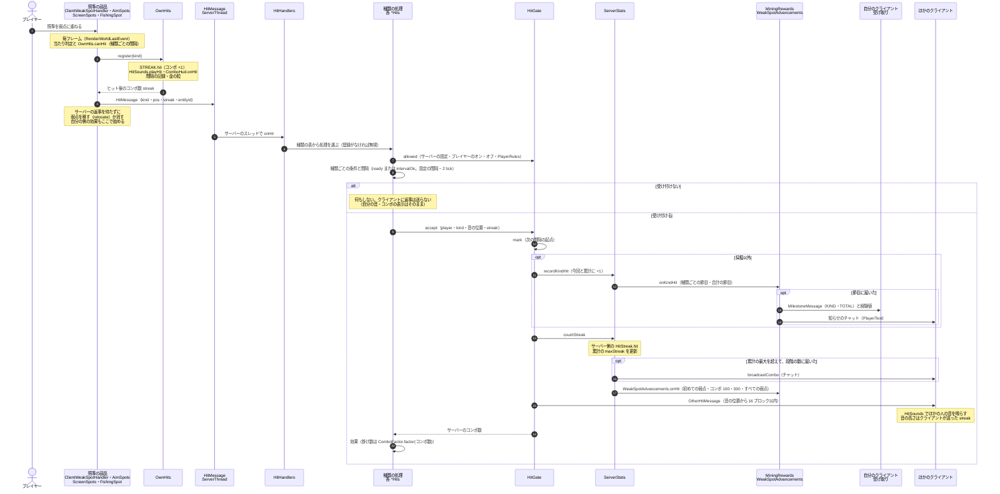
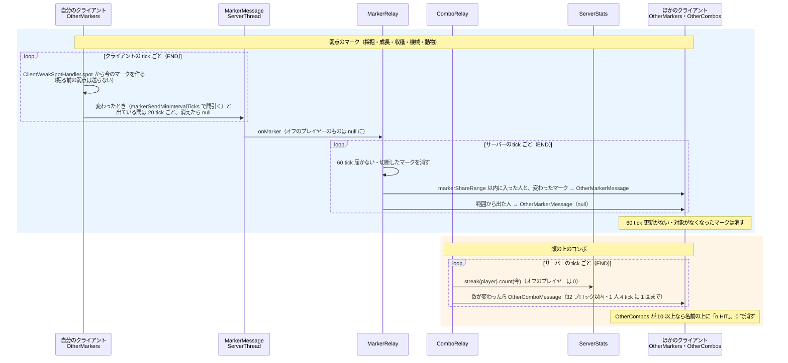

# 図 2　ヒットの流れ

[← 図の一覧に戻る](README.md)

- [2a　ヒット 1 回の流れ](#2a-ヒット-1-回の流れ)（すべての種類に共通）
- [2b　ヒットとは別の時刻に動く配信](#2b-ヒットとは別の時刻に動く配信)（頭の上のコンボ・弱点のマーク）
- [種類で違う箇所](#種類で違う箇所)

## 2a ヒット 1 回の流れ

### 注記

- コンボは**両側で別々に数える**。クライアントは `OwnHits.STREAK`（音・表示）、サーバーは `ServerStats` の `HitStreak`（効果の掛け数・統計・知らせ・進捗）。`HitMessage` の `streak` は、ほかの人の音の高さにだけ使う。
- サーバーがヒットを受け付けなかったときも、クライアントの音・コンボの表示・弱点の移動は戻らない（返事のパケットがない）。
- `accept` の中の順序は「`mark` → 種類ごとの数と節目 → コンボ → 進捗 → `OtherHitMessage`」。効果はそのあと。
- 節目の知らせのチャットは、本人以外の全員に送る。`MilestoneMessage` は本人だけに送る（`MilestoneEffects.show`）。
- クライアント行きのメッセージは、`WeakSpotMod.proxy`（`ClientProxy`）経由でクライアントのスレッドに渡す。

## 2b ヒットとは別の時刻に動く配信

### 注記

- マークは、サーバーが位置を確かめずにそのまま転送する（見えるだけで、ヒットや破壊には関係しない）。
- `markerShareRange` が 0 以下なら、クライアントは送らない。
- 頭の上のコンボは、ヒットの瞬間ではなくサーバーの tick の終わりにまとめて送る。途切れた（数が 0 になった）ことも同じ経路で届く。
- 的当ての頭の上の表示は `OtherTargetMessage` で、`TargetRounds` が直接送る（[図 3c](03-states.md#3c-的当てのラウンド)）。

## 種類で違う箇所

図 2a の共通の流れから外れる所です。リファクタのあとも、ここが同じかを確かめます。

| 種類 | 違い |
|---|---|
| 採掘 | 掘っていないとき（`Mining` がない・位置が違う・`isDestroyingBlock` が false）のヒットは、`ServerBoostTracker.RESERVED` に予約する（プレイヤーごとに 1 つ。`accept`・統計は呼ばない）。同じブロックを `PRE_DIG_TICKS`（20 tick）のうちに掘り始めたら（`LeftClickBlock`）、`apply` で確定する。クライアントは、掘る前に当てられるのは 1 回だけ（`MiningBoost.hasPreHit`）で、左クリックを押している間だけ当たる |
| 採掘 | `accept` は種類ごとの数を数えない。代わりに `accept` のあとで `ServerStats.record(recordHit)` と `MiningRewards.onMiningHit`（採掘の節目・合計の節目。経験値と道具の耐久回復）。耐久回復は `BreakEvent`（LOWEST）で精算する（`onBlockBroken`）。効果は `Mining.extraTicks` に貯めて `BreakSpeed` に掛ける（`BoostMath`） |
| 採掘 | クリエイティブのヒットは受け付けない |
| 成長・機械・収穫 | `RightClickHits`: 直前 10 tick にそのブロックを右クリックした記録・届く距離・`classify` が同じ種類か、を確かめる。間隔の起点は効果の成否の前に記録する（収穫が失敗しても間隔を待つ。クライアントが先に同じ間隔を守って送るので実害なし） |
| 収穫 | 効果（`HarvestHits.harvest`、コンボは `peekStreak` で先に見る）が成功してから `accept` |
| エンチャント | 効果（乱数の引き直し）が成功してから `accept` |
| 機械 | 効果は `MachineAccelerator.hit`（`accept` が返したコンボ数で倍率を決める） |
| 成長 | 効果のあと `GrowthWarnings`（自動の対象では呼ばない） |
| 動物・機械・釣り | ヒットの前に `QueryMessage` / `StateMessage` で状態を問い合わせ、返事が来るまでクライアントは弱点を出さない（動物・釣り）。機械はバーのためだけ。ヒットのときは即座に問い合わせ直す |
| はしご・エリトラ・走り・泳ぎ・落下 | `MoveHits` が、直前 10 tick のどこかでその状態だったかで確かめる |
| 動物・近接 | `HitMessage.entity` で相手のエンティティ ID を送る。音の位置は相手 |
| 釣り・弓・食事など | 位置を使わない（`BlockPos.ORIGIN`）。音の位置は浮き・プレイヤーなど種類ごと |
| 照準のまわり（`AimSpots`） | 当てたあと `keepAfterHit` なら移す、でなければ消す（弓は引き切って過剰チャージも上限なら消す） |
| 画面のマーカー（睡眠・エンチャント） | `ScreenSpots` から送る。睡眠はカーソルを重ねるだけ、エンチャントは左クリック（当てたクリックはキャンセル） |
| 的当て | `HitMessage` を使わない。`TargetActionMessage`（HIT / DECOY）→ `TargetRounds.onAction`。`accept`・コンボ・統計の種類別の数・節目は通らない。`OtherHitMessage` だけ同じ（✕ なら `miss`、streak はラウンドの中の数） |
