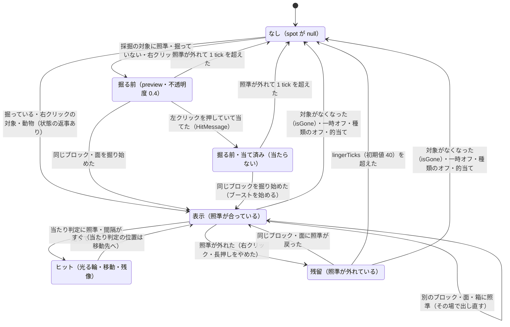
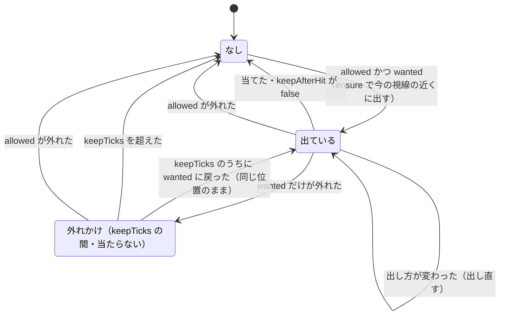
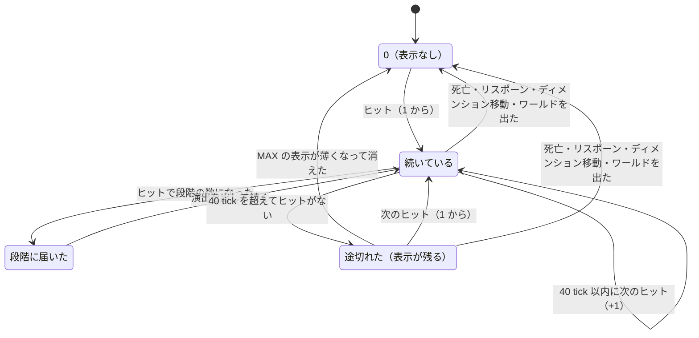
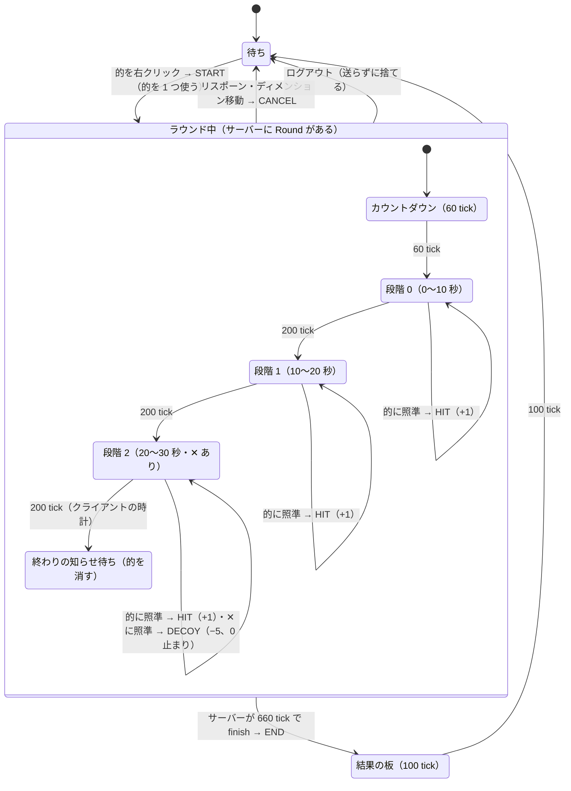

# 図 3　状態遷移

[← 図の一覧に戻る](README.md)

- [3a　弱点の一生（ブロック・動物）](#3a-弱点の一生ブロック動物)
- [3a′　弱点の一生（照準のまわり）](#3a-弱点の一生照準のまわり)
- [3b　コンボ](#3b-コンボ)
- [3c　的当てのラウンド](#3c-的当てのラウンド)

## 3a 弱点の一生（ブロック・動物）

自分の弱点は一度に 1 つ（`ClientWeakSpotHandler.spot`）。採掘・成長・収穫・機械・動物が使います。判定は毎フレーム（`RenderWorldLastEvent` の `updateAim`）、消すのは tick の始め（`ClientTickEvent` START）。

### 注記

- 出すときに面が小さすぎる（短い辺が `minFaceSize` 未満）と、`WeakSpot.spawn` が null を返して「なし」のまま。
- 「ヒット」は一瞬の状態。当たり判定の位置（`u` / `v`）はすぐ移動先へ変わり、表示の位置（`motion`）は 80 ms の ease-out で追いかけ、通った道に残像を 4 個（150 ms で消える）。`weakSpotTrailEnabled` がオフなら表示もすぐ移る。光る輪（`addFlash`）は 6 tick。
- 掘る前に当てたブロックは `MiningBoost.hasPreHit` が 20 tick 覚えている。いったん照準が外れて戻っても、その間はもう一度は当たらない。
- 「掘る前」の弱点はほかの人に送らない（[図 2b](02-hit-flow.md#2b-ヒットとは別の時刻に動く配信)）。それ以外は、出た・動いた・消えたを送る。
- 「表示」でも、照準の面が弱点の面と違う（右クリック・動物）ときは当たらない。成長・収穫の面は、見えている間は変えない。動物は、弱点の面が見えなくなったら照準の面に出し直す。
- 掘る前の弱点はサーバーが 1.11.2 以上のときだけ（`ServerFeatures.since("1.11.2")`）。
- 消えたあと: マークの送信が「消えた」を送り、耐久バー・成長バー・動物のバーも出なくなる。

## 3a′ 弱点の一生（照準のまわり）

`AimSpots` の 11 種類（乗り物・食事・弓・はしご・走り・エリトラ・投げる物・近接・ゲート・泳ぎ・落下）。種類ごとに 1 つずつ同時に持つ。出す・消すは tick の始め、当たりは毎フレーム。

### 注記

- `allowed`（共通）: ワールドにいる・種類がオン（自分の「弱点マーカー」タブ、サーバーの設定）・的当て中でない・`PlayerRules.canUse`・手を使っていない（弓・食事は手を使っていてもよい）。一時オフもここで外れる。
- `wanted`（種類ごと）: 弓を引いている、ゲートの中にいる、など。
- `keepTicks`: 走り・はしご・泳ぎ・エリトラ・乗り物は 10、ほかは 0（すぐ消える）。
- 「離れたら出し直す」は、上下だけの出し方は pitch、左右だけは yaw、全方向は角度で測る。落下（`FEET_WINDOW`）は出し直さない（画面にないときは端に矢印）。
- `keepAfterHit` が false になるのは弓だけ（引き切って、過剰チャージも上限）。
- ボートに乗っているときは、ボートが曲がった分だけ毎 tick 弱点も回る（`VehicleSpot.followBoat`）。
- 釣り（`FishingSpot`）と画面のマーカー（睡眠・エンチャント、`ScreenSpots`）は別の仕組みなので、この図には入れない。

## 3b コンボ

連続ヒット数（`common/HitStreak`）。**クライアント**（`OwnHits.STREAK`。音・表示）と**サーバー**（`ServerStats` の `HitStreak`。効果の掛け数・統計・知らせ・頭の上のコンボ）で、別々に数えます。1.11.3 から、ずれたらサーバーの数でクライアントを直します（`common/ComboSync`）。

### 注記

- ちょうど 40 tick あいたヒットは続く（41 tick 目から途切れ）。
- クライアントの時間は `clientTick`（一時停止で止まる）、サーバーは `getTickCounter`。
- 「途切れた」はクライアントだけの状態（`HitStreak.expire` を毎 tick 呼び、`ComboHud.onBreak`）。5 以上なら「MAX n」を 20 tick 残してから 10 tick で薄くする。10 以上なら下がる 2 音（`HitPitch.breakNotes`）。サーバーは途切れたことを数えず、次のヒットで 1 から数え直す。頭の上のコンボには 0 が届く。
- 0 に戻すきっかけの違い: クライアントは体力が 0 になった時点・プレイヤーが作り直された時点（リスポーン・ディメンション移動）・ワールドを出たとき。サーバーはリスポーン・ディメンション移動・ログアウト（`HitGate.forgetAll`）。
- 表示は 2 以上（「12 HIT」）。段階の演出は `comboDisplayEnabled` と `comboMilestoneEffects` の両方がオンのとき。
- 的当てのヒットはコンボに数えない（ラウンドの中に別の数を持つ）。

### 段階の表

| コンボ | 色（`ComboTier`） | 掛け数（`ComboFactor`。この数から） | 段階の演出（`ComboEffects`） |
|---|---|---|---|
| 2〜 | 白 `#FFFFFF` | 1.0 | （表示だけ） |
| 10 | 黄 `#FFFF55` | 1.0 | 分散和音（ド・ミ・ソ） |
| 25 | 橙 `#FFAA00` | 1.25 | 分散和音 |
| 50 | 赤 `#FF5555` | 1.5 | 分散和音 |
| 75 | ピンク `#FF55FF` | 1.5 | 分散和音 |
| 100 | 紫 `#AA55FF` | 2.0 | 和音 |
| 150 | 青 `#5599FF` | 2.5 | 短い駆け上がり・強い光・大きな弾み |
| 200 | 水色 `#55FFFF` | 3.0 | 1 オクターブの駆け上がり・花火 1 発 |
| 250 | 緑 `#55FF55` | 3.5 | 1 オクターブの駆け上がり・花火 1 発 |
| 300 | 金 `#FFD700` | 4.0 | 2 オクターブ・和音・花火 3 発・タイトル「300 COMBO!」 |
| 400 から 100 ごと | 虹色（400〜） | 300 の先は 100 ごとに +0.5（上限なし） | 1 オクターブ・花火 1 発・タイトル（500 ごとは 2 オクターブ・和音・花火 3 発、光は金） |

- 段階の数（`ComboMilestones.isStep`）は 10・25・50・75・100・150・200・250・300、以降 100 ごと。
- サーバー: 累計の `maxStreak` を超えて段階の数に届いたら、本人以外の全員にチャット（`broadcastCombo`）。コンボ 100・300 で進捗。
- 掛け数を使う種類（`HitKind.usesComboFactor`）は、コンボの表示の下に「種類 ×掛け数」と次の段階までのゲージ。
- ヒット音の和音（`HitPitch.chordOffsets`）も段階で変わる（25 から重ねる。`hitChordEnabled`）。

## 3c 的当てのラウンド

サーバー（`TargetRounds`）がラウンドを持ち、時間の正もサーバー。クライアント（`TargetPlay`）は START を受け取った時刻から自分の `clientTick` で数えて的を動かします。

### 注記

- 始め方: 「弱点の的」（`ItemTarget`）の右クリックで `TargetRounds.start`。ラウンド中の右クリックは無視し、的も減らない。クリエイティブでは減らさない。初めての人（`targetRounds` が 0）には始まる前にルールをチャットで出す。
- ラウンド中は、ほかの種類の弱点を出さない（`KindSwitches.isEnabled` が false）。持ち替え・画面を開いてもラウンドは続く（画面を開いている間は当たらない）。
- サーバーの受け付け: カウントダウンのあとから 600 tick の間で、前の受け付けから 4 − 2 tick たっていること。受け付けたら SCORE（今のヒット数）を本人に、`OtherTargetMessage` を 32 ブロック以内の人に、`OtherHitMessage` を 16 ブロック以内の人に送る。
- クライアントの当たり: 毎フレーム、✕ を先に調べ、次に的。間隔は 4 tick。当てた的は前の位置から離して置き直す。✕ は 40 tick ごとにも移る。
- 段階ごとの値（`TargetRules`）:

| 段階 | 的の半径（GUI px） | 枠の幅（左右・上下、度） | 速さ（度 / tick） | ✕ の数 |
|---|---|---|---|---|
| 0 | 16 | ±15・±10 | 0 | 0 |
| 1 | 11 | ±25・±15 | 0.35 | 0 |
| 2 | 8 | ±30・±18 | 0.8 | 2 |

- 終わり（`finish`）: 累計の `targetBest`・`targetRounds` を書き、`Leaderboard` を更新し、END（ヒット数・自己ベスト・新記録か・新しく届いたご褒美の段階・当てた数・✕ の数・サーバーの 1 位）を送る。進捗（的当ての 4 段階）を与える。サーバーの 1 位を上回ったら全員にチャット。クライアントは結果の板を出し、新記録なら金の花火 3 発。
- ご褒美の段階（`TargetRules.Tier`）: 銅 25・銀 50・金 75・虹 100。
- やめるのはリスポーン・ディメンション移動・ログアウトのとき（`HitGate.forgetAll`）。**死亡の瞬間にはやめない**。死んでいる間（リスポーン前）に 660 tick を過ぎると、サーバーは普通に終わらせて記録する（要確認: 仕様書の「死ぬとやめる（記録なし）」との違い。下の一覧）。
- ログインのときに RECORD（自己ベストと、取った進捗のいちばん上の段階）を送る。
