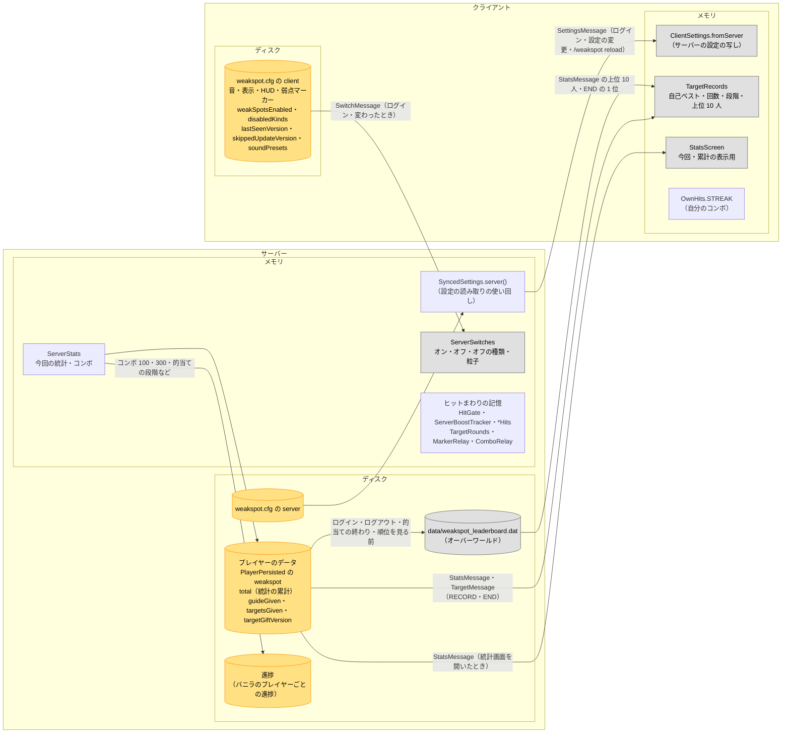

# 図 4　データの持ち場所

[← 図の一覧に戻る](README.md)

どのデータが、どこにあり、どちらを正とするか。クライアントとサーバーを枠で分け、それぞれの中をメモリとディスクに分けています。

## 凡例

| 見た目 | 意味 |
|---|---|
| 黄 `#FFE082` | 正（ほかはここから作る） |
| 灰 `#E0E0E0` | 写し（正から送られた・写したもの） |
| 円柱 | ディスクに残るもの |
| 四角 | メモリだけ（ログアウト・ワールドを出たときに消える） |

## 一覧

| データ | 置き場所 | 正とするもの | 送り方・写し方 |
|---|---|---|---|
| `[サーバー]` の設定 | サーバーの `weakspot.cfg`（`server` カテゴリ） | サーバー | クライアントが使う項目だけ `SyncedSettings` → `SettingsMessage`。ログイン時、設定画面での変更、`/weakspot reload`。クライアントは `ClientSettings.get()` で読む（つないでいないときは自分の cfg から作る）。受け取った値は cfg に書かない |
| サーバーだけが使う設定 | 同じ | サーバー | 送らない（例: `maxRepairPerBreak`・報酬・`villagerResetUnlocksNewTier`） |
| `[クライアント]` の設定 | クライアントの `weakspot.cfg`（`client` カテゴリ） | 各自 | サーバーに送らない。ただしオン・オフの 3 つは下の行 |
| 弱点のオン・オフ・オフにした種類・機械の粒子 | クライアントの cfg | クライアント | `SwitchMessage` → `ServerSwitches`（メモリ）。届く前はオン |
| 統計の累計（種類ごとの数・`maxStreak`・`hitsOnBrokenBlocks`・`targetBest`・`targetRounds` など） | プレイヤーのデータの `PlayerPersisted` → `weakspot` → `total`（死亡・ディメンション移動で引き継がれる） | サーバー | `StatsRequestMessage` → `StatsMessage`。リセットは `targetBest`・`targetRounds` を残して消す |
| 今回の統計 | サーバーのメモリ（`ServerStats.SESSIONS`） | サーバー | 同じ。ログアウトで消える |
| コンボ | クライアント `OwnHits.STREAK`・サーバー `ServerStats.STREAKS`（どちらもメモリ） | それぞれ（[図 3b](03-states.md#3b-コンボ)） | サーバーの数だけ `OtherComboMessage` でほかの人へ（1.11.3 から、ずれたときは本人にも） |
| 配った物の記録 | プレイヤーのデータの `weakspot` の `guideGiven`・`targetsGiven`・`targetGiftVersion` | サーバー | 送らない |
| 順位 | オーバーワールドの `data/weakspot_leaderboard.dat`（UUID ごとの名前・採掘ヒット数・最大コンボ・的当ての自己ベスト・合計） | プレイヤーの累計（ここは写し） | ログイン・ログアウト・的当ての終わり・順位を見る直前（オンラインの全員）に累計から写す。オフラインの人の分はここにだけ残る |
| 進捗 | バニラの進捗（プレイヤーごと） | サーバー | 条件はどれも `minecraft:impossible`。ログインで累計から判定し直す |
| 自己ベストとご褒美の段階（クライアント側） | クライアントのメモリ `TargetRecords` | サーバー | ログインの RECORD、的当ての END、`StatsMessage` で受け取る |
| 掘る前の予約・間隔・ブースト・溜めなど | サーバーのメモリ（`ServerBoostTracker`・`HitGate`・各 `*Hits`） | サーバー | 送らない。`HitGate.forgetAll` で消す |
| 弱点のマーク | クライアントのメモリ（`OtherMarkers`）・サーバーのメモリ（`MarkerRelay`） | 出したクライアント | [図 2b](02-hit-flow.md#2b-ヒットとは別の時刻に動く配信) |
| ガイドの本 | アイテムの NBT（`weakspotGuide`） | — | 本の中身は翻訳キーで、読む人の言語で出る |

## 注記

- シングルプレイ・LAN のホストでは、サーバーとクライアントが同じ `weakspot.cfg` を使う（1 つのファイルに `server` と `client` の両方がある）。設定画面で変えると、`SettingsSync.resendToAll` で全員に送り直す。
- サーバーは自分の設定を 2 通りで読む: `SyncedSettings.server()`（送る項目。作り直すのは設定が変わったとき）と、`WeakSpotConfig.server.…` の直接の読み取り（送らない項目など）。
- 統計の累計は、ヒットのたびにプレイヤーのデータの NBT を読み、書き直す（`ServerStats.record`）。ディスクに書かれるのは、バニラがプレイヤーのデータを保存するとき。
- 的当ての上位（`StatsMessage` の最後）は、順位の写しから作る。
